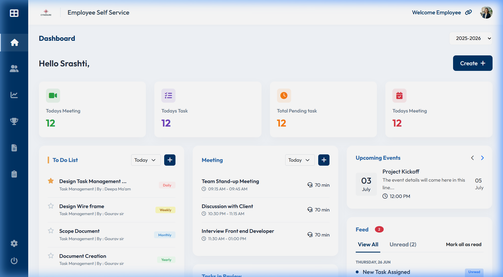

# 📊 Dashboard Project

## 🔗 Live Demo

👉 [Live Link](https://employee-self-service-dashboard.netlify.app)

---

## 📸 Screenshots

### Desktop View


---

## 💻 Repository

👉 [GitHub Link](https://github.com/srashtidawande/Employee-Self-Service-Dashboard)

---

## 📌 Overview

Responsive dashboard built from Figma design using HTML, CSS, Bootstrap, JavaScript, and jQuery.

---

## 🚀 Tech Stack

HTML • CSS • Bootstrap • JavaScript • jQuery

---

## ✨ Features

* Responsive (Mobile, Tablet, Desktop)
* Clean UI (Figma-based)
* Interactive elements

---

## 📂 Structure

```
index.html
/css
/js
/images
```

---

## 👩💻 Author

Srashti Dawande
LinkedIn: [srashti-dawande-01884b202](https://www.linkedin.com/in/srashti-dawande-01884b202)
